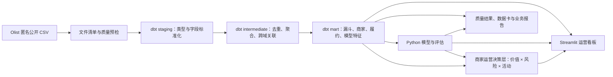
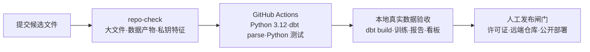

# 解决方案架构

## 1. 总体架构



所有组件本地运行。DuckDB 是统一分析存储；dbt 管理 SQL 依赖、测试、文档和血缘；Python 只负责下载/校验、模型训练评估和少量结果导出；Streamlit 只读取已验证的 mart 与模型结果，不复制业务口径。

## 2. 数据分层

| 层 | 责任 | 典型对象 | 禁止事项 |
|---|---|---|---|
| raw/external | 保留原始文件，只读访问 | 9 个 Olist CSV | 修改原文件、静默纠错 |
| staging | 字段重命名、类型转换、基础合法性标记 | `stg_orders`、`stg_mql` | 复杂业务聚合、多表宽连接 |
| intermediate | 明确粒度、去重候选、订单/评价/支付聚合、历史特征 | `int_order_financials`、`int_order_reviews` | 面向页面的展示逻辑 |
| mart | 面向决策的稳定主题表和模型特征表 | `mart_channel_funnel`、`mart_delivery_experience` | 重复定义指标 |
| artifacts | 模型、评估、排序名单和报告数据 | JSON/CSV/Parquet/模型文件 | 提交大文件或把结果伪装为源数据 |

## 3. 模块关系

| 模块 | 输入 | 输出 | 主要消费者 |
|---|---|---|---|
| `src/ingest.py` | 原始目录/下载来源 | 文件清单、哈希、可选下载 | dbt sources、数据卡 |
| `dbt/models/staging` | CSV sources | 类型规范化视图 | intermediate、质量测试 |
| `dbt/models/intermediate` | staging | 单一粒度的业务中间表 | marts、特征工程 |
| `dbt/models/marts` | intermediate | 主题 mart 和安全特征表 | 看板、模型、报告 |
| `src/features.py` | mart | 时间截点特征与切分元数据 | 三类训练流程 |
| `src/train.py` | 特征 | 基线/候选模型、预测分数 | evaluate、看板 |
| `src/evaluate.py` | 标签与预测 | 指标、误差分析、解释结果 | 模型卡、报告、看板 |
| `src/decisioning.py` | 商家资源计划、风险 mart、活动概率 | 互斥行动类型、稳定优先排名、容量覆盖 | 运营行动页、业务报告、下载清单 |
| `src/experiments.py` | P10 资格快照、实验设计参数、真实日志 | 草案随机分组、样本量/MDE、日志校验结果 | 实验设计页、未来实验分析 |
| `app/` | mart 与 artifacts | 多页交互看板、CSV 下载 | 运营/面试演示 |

P11 位于决策层之后，且不把实验结果回写成模型特征：

```text
P10 商家行动快照
        ↓ 只读资格字段
实验登记 → 稳定随机分组 → 真实执行日志 → 成熟结果日志
        ↓                ↓                 ↓
     设计审计         过程/成本          ITT 效果评估
```

当前没有执行和结果数据，因此实验页面只展示规划和草案分组，不渲染效果结论。未来接入日志时，应先通过主键、时间和分子分母校验，再进入独立实验分析 mart。

## 4. 技术选型与取舍

### DuckDB

- 选择原因：适合单机分析，可直接读 CSV/Parquet，SQL 能处理本项目十万级订单和多表聚合；
- 取舍：不使用 PostgreSQL、Spark 或云仓库，避免引入部署、费用和运维噪音；
- 当前官方文档说明 `read_csv` 支持类型和方言自动识别，但本项目 staging 会显式转换关键日期和数值，避免只依赖抽样推断。

### dbt-duckdb

- 选择原因：用 `ref`/`source` 表达依赖，用数据测试和文档固化口径；本地文件数据库便于复现；
- 取舍：源 CSV 通过 `external_location` 引用，最终 mart 写入 DuckDB；不引入额外编排平台；
- 兼容策略：以最终锁定的 `requirements.txt` 为准；当前官方仓库说明近期版本支持 dbt-core 1.8+ 并可持久化到 `path` 指定的 DuckDB 文件，实施前仍需用实际安装版本验证。

### scikit-learn

- 选择原因：流水线、类别编码、逻辑回归、树模型、校准和指标覆盖完整，便于面试解释与复现；
- 取舍：优先逻辑回归和直方图梯度提升/随机森林，不引入 XGBoost 等额外依赖；
- 所有预处理只在训练集拟合，验证/测试仅变换。

### Streamlit + Plotly

- 选择原因：本地数据应用开发快，交互筛选和下载适合运营演示；
- 组织方式：按当前官方推荐使用 `st.Page` 与 `st.navigation`；
- 取舍：不是生产级 BI 权限系统，不承担行级权限、实时数据或告警。
- P11 复用现有依赖增加实验设计页；该页面用于实验前规划与审计，不代表实验已经运行。

## 5. 运行链路

1. `make setup` 或 README 中等价命令创建隔离环境并安装锁定依赖；
2. 用户按说明放置数据或运行获授权的数据准备命令；
3. 数据预检核对文件名、列名、大小与哈希清单；
4. `dbt build` 生成分层模型并运行测试；
5. Python 命令按时间切分训练三类模型并写入 `artifacts/`；
6. 决策层将商家活动产物与商家风险 mart 一对一合并，生成规则化行动清单和容量覆盖；
7. 测试命令验证指标公式、Top-K、时间切分、泄漏黑名单和行动规则稳定性；
8. Streamlit 连接只读 DuckDB 和结果文件；
9. 报告生成脚本只引用已存在的指标结果，不填造数字。

## 6. 可追溯与可观测设计

- 每次模型运行记录：数据截至时间、数据哈希、特征列表、禁用特征、切分边界、随机种子、依赖版本和指标；
- 每个看板组件在代码中绑定 mart 和字段，页面展示“数据截至时间/口径”入口；
- `docs/traceability.md` 维护需求到文件、测试和证据的映射；
- `docs/logs/` 记录真实修改、命令、问题与局限；
- 数据质量结果保留规则 ID、异常数、分母、异常占比、样例实体（不含隐私）和运行时间。

## 7. 安全与部署边界

- 默认无网络运行，除数据下载和首次依赖安装外不需要联网；
- `.env`、原始 CSV、DuckDB、模型和大结果文件进入 `.gitignore`；
- 配置模板只放路径和非敏感默认值；
- 公开部署前检查数据再分发条款，并避免暴露可被滥用的细粒度地理数据；
- 本项目不执行自动营销触达或业务写回。

## 8. 参考文档（核对日期：2026-07-30）

- [dbt-duckdb 官方仓库](https://github.com/duckdb/dbt-duckdb)
- [DuckDB CSV 导入文档](https://duckdb.org/docs/stable/data/csv/overview)
- [Streamlit 多页应用文档](https://docs.streamlit.io/develop/concepts/multipage-apps/page-and-navigation)

## 9. 发布与验证架构（P13）

P13 将验证拆成三层，避免把“CI 通过”误写成“真实数据系统已复现”：



CI 不读取 `data/raw/`、`data/processed/` 或 `artifacts/`，只验证版本化代码、聚合证据和页面契约。带真实数据的构建、模型新鲜度和截图仍在本地完成；代码许可证和对外发布必须由仓库所有者确认。
