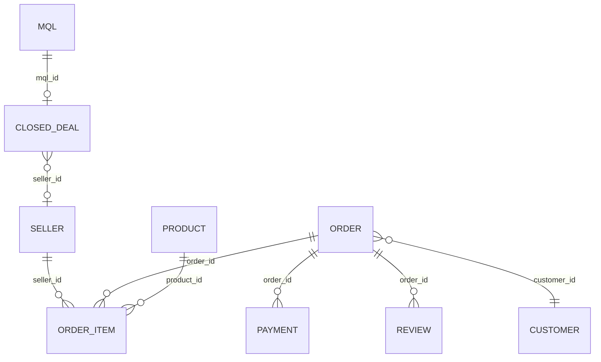

# 数据设计

## 1. 数据来源与边界

| 数据域 | 预期文件 | 主粒度 | 用途 |
|---|---|---|---|
| 营销线索 | `olist_marketing_qualified_leads_dataset.csv` | MQL | 首次接触、来源、线索画像 |
| 成交 | `olist_closed_deals_dataset.csv` | 成交记录/MQL | 成交标签、商家映射 |
| 商家 | `olist_sellers_dataset.csv` | 商家 | 商家地区 |
| 订单 | `olist_orders_dataset.csv` | 订单 | 状态与全链路时间 |
| 订单商品 | `olist_order_items_dataset.csv` | 订单商品 | 商家、品类、价格、运费 |
| 支付 | `olist_order_payments_dataset.csv` | 订单支付序号 | 支付方式与金额校验 |
| 评价 | `olist_order_reviews_dataset.csv` | 评价记录 | 评分与评价时间 |
| 商品 | `olist_products_dataset.csv` | 商品 | 品类与商品属性 |
| 客户 | `olist_customers_dataset.csv` | 客户/订单客户 ID | 客户地区 |
| 地理位置（可选） | `olist_geolocation_dataset.csv` | 邮编前缀坐标观测 | 距离代理变量 |
| 品类翻译（可选） | `product_category_name_translation.csv` | 品类 | 英文展示名 |

Marketing Funnel 样本与电商样本均来自 Olist 公开匿名数据。Olist 官方营销题目仓库说明营销数据约含 8 千条匿名随机抽样 MQL，时间约为 2017-06-01 至 2018-06-01；实际行数和日期以下载文件验证为准。

## 2. 许可、隐私与发布规则

- 代码许可和数据许可分开管理；上游代码复用记录在 `THIRD_PARTY_NOTICES.md`；
- 2026-07-30 核对的 Olist 官方 Kaggle 数据页将电商数据与营销漏斗均标为 CC BY-NC-SA 4.0；项目必须署名、仅作非商业用途，并以相同方式共享衍生材料；
- 默认不提交原始 CSV，只提交文件清单、下载指引和可选哈希；
- 不尝试把匿名 ID 与现实个人或商户关联，不展示评价文本中的潜在敏感内容；
- 地理坐标仅用于距离或区域聚合，公开看板避免细粒度点位展示；
- 无密钥下载优先；若数据平台要求凭证，只提供 `.env.example`，不读取、不记录、不提交真实凭证。

来源页：[Brazilian E-Commerce Public Dataset by Olist](https://www.kaggle.com/datasets/olistbr/brazilian-ecommerce)、[Marketing Funnel by Olist](https://www.kaggle.com/datasets/olistbr/marketing-funnel-olist)。许可核对日期为 2026-07-30，公开发布前仍应再次确认页面条款是否变化。

## 3. 逻辑关系与粒度

关键风险是 `order_items × payments × reviews` 直接连接会产生多对多放大。因此先分别聚合到订单或“订单-商家”粒度，再连接。平台订单数和卖家订单数语义不同，禁止混用。

## 4. 核心字段设计

### 线索与成交

| 字段 | 类型 | 规则/用途 |
|---|---|---|
| `mql_id` | string | 线索业务键，非空；重复需报错 |
| `first_contact_at` | timestamp | 线索预测时点和时间归属 |
| `landing_page_id` | string | 成交前可用类别特征 |
| `origin` | string | 渠道；空值统一为 `unknown` 但保留缺失标记 |
| `won_at` | timestamp | 仅用于标签/分析，禁止作为线索特征 |
| `seller_id` | string | 成交后映射，禁止作为线索特征 |

### 订单与履约

| 字段 | 类型 | 规则/用途 |
|---|---|---|
| `order_id` | string | 订单主键，非空且唯一 |
| `customer_id` | string | 订单级客户键；不等同于稳定用户键 |
| `order_status` | string | 保留原始值并映射状态组 |
| `purchased_at` | timestamp | 低评分预测时点、需求时间轴 |
| `approved_at` | timestamp | 只用于指定预测时点后的扩展模型 |
| `carrier_delivered_at` | timestamp | 实际发货交接；下单时风险模型禁用 |
| `customer_delivered_at` | timestamp | 最终结果；风险模型绝对禁用 |
| `estimated_delivery_at` | timestamp | 下单时已知的承诺时点 |
| `review_score` | integer | 标签/体验分析；风险特征绝对禁用 |

### 金额与商品

| 字段 | 类型 | 规则/用途 |
|---|---|---|
| `price` | decimal/double | 非负；商品价格 |
| `freight_value` | decimal/double | 非负；运费 |
| `payment_value` | decimal/double | 非负；仅校验和支付分析，不替代 GMV |
| `seller_id` | string | 订单商品的履约责任主体 |
| `product_id` | string | 商品关联键 |
| `category_name` | string | 空值归为 unknown 并保留缺失标记 |

## 5. 质量规则

| 规则 ID | 检查 | 分母 | 严重级别 | 处理原则 |
|---|---|---|---|---|
| DQ-01 | MQL 主键重复 | MQL 行数 | error | 不自动选择，阻断特征表 |
| DQ-02 | 同一 MQL 多条成交 | 有成交 MQL | error | 分析重复模式后确定规则 |
| DQ-03 | 成交缺失 seller_id | 成交记录 | warn/error | 不进入商家链路，保留在线索成交统计 |
| DQ-04 | won_at 早于首次接触 | 成交记录 | error | 不作为有效成交 |
| DQ-05 | 订单主键重复 | 订单行数 | error | 阻断订单 mart |
| DQ-06 | 商品/运费/支付金额负值 | 对应明细 | error | 排除主指标并报告 |
| DQ-07 | 商品金额与支付金额差异 | 可比订单 | warn | 两者口径不同，只做异常提示 |
| DQ-08 | 签收早于下单或发货 | 可比较订单 | error | 排除时长/延迟计算 |
| DQ-09 | 评分不在 1–5 | 评价记录 | error | 排除评价指标并报告 |
| DQ-10 | 多评价订单 | 有评价订单 | warn | 使用最新合法评价，披露比例 |
| DQ-11 | 订单商品无法关联卖家/商品 | 订单商品 | error | 进入无法关联清单 |
| DQ-12 | 订单无法关联客户/地区 | 订单 | warn | 保留订单，地区归 unknown |
| DQ-13 | 延迟判断时间缺失 | 已签收订单 | warn | 不进入延迟率分母，报告缺失率 |
| DQ-14 | 类别缺失或翻译缺失 | 商品/品类 | warn | 归 unknown/原语言，不丢订单 |

每条规则必须输出 `rule_id`、`checked_count`、`issue_count`、`issue_rate`、`severity`、`run_at`。不得只输出布尔通过/失败。

## 6. 主题表设计

| 表 | 粒度 | 核心字段 |
|---|---|---|
| `mart_channel_funnel` | 首次接触月 × 来源 | MQL、成交、成交率、成交商家数、成交周期 |
| `mart_channel_seller_value` | 来源 × 商家经营月 | 成交商家数、活跃商家数、GMV、订单、延迟/低评分率 |
| `mart_channel_summary` | 来源 | 去重成交商家及其全生命周期 GMV/体验，避免跨月重复计数 |
| `mart_seller_performance` | 商家 × 月 | GMV、订单、客单、活跃天、延迟/低评分率、30/60/90 天窗口 |
| `mart_delivery_experience` | 订单 | 履约时长、延迟、评分、主品类/主商家、多商家标记、金额 |
| `mart_seller_risk` | 商家 × 数据截至日 | GMV 分位、延迟率、低评分率、风险层级、原因 |
| `mart_lead_features` | MQL | 成交前特征、成交标签、预测时点 |
| `mart_review_risk_features` | 订单 | 下单时特征、历史聚合、低评分标签、预测时点 |
| `mart_demand_weekly` | 商家/品类 × 周 | 订单量、GMV、滞后和滚动特征所需基础序列 |

P11 的实验日志不是 Olist 公开数据的一部分，也不进入当前 dbt 真实数据层。`data/templates/experiment/` 只保存四张空表的数据契约：实验登记、分组、执行和结果。未来接入真实运营源后，建议先进入受控 raw 区，再增加 staging 类型/枚举检查、intermediate 主键与时间链路、mart 的 ITT 汇总；真实源不存在时不创建带假记录的 dbt model。

| 实验数据集 | 粒度 | 主键/唯一约束 | 关键连接 |
|---|---|---|---|
| experiment registry | 一次实验 | `experiment_id` | 无 |
| assignment log | 实验中的一个商家分组 | `assignment_id`；`experiment_id + seller_id` 唯一 | registry |
| execution log | 一次执行尝试 | `execution_id` | assignment |
| outcome log | 一个分组观察窗 | `outcome_id`；建议观察窗唯一 | assignment |

实验隐私边界：公开仓库只保留表头；不得写入姓名、电话、邮箱、聊天原文或内部明文商家 ID。`operator_id_hash` 也必须由真实数据治理方批准，普通无盐哈希不能被当作完整匿名化。

## 7. 数据版本与可复现

- `data/processed/raw_manifest.json` 记录文件名、字节数和 SHA-256；原始文件与生成清单均不提交；
- staging 模型显式选择字段，避免上游新增列悄悄进入模型；
- 所有时间统一保留原始无时区时间戳，并在数据卡说明公开样本未提供可靠时区；
- 数据更新后必须重跑质量检查、dbt、模型评估和报告，不能沿用旧数字。

## 8. 数据验证结果

- 成交表无同一 MQL 多条成交，但有 1 条成交早于首次接触；
- 547 个订单有多条评价，按最新合法评价固定订单粒度；多商家订单在订单主题中保留主商家和商家数；
- 精确地理表未进入发布产物，看板使用州级聚合；
- 品类级回测 WAPE 31.31%；P9 商家两阶段期望订单量 WAPE 为 84.46%，活动分类 PR-AUC 0.680。商家订单量相对原 85.71% 仅小幅改善，且间歇活跃层 WAPE 仍为 122.99%，因此品类仍承担总量主交付，商家侧主要用于活动优先级和运营排序。
- P10 使用 `seller_id` 将 3,051 个可评分商家与风险 mart 一对一连接，连接缺失和主键重复均为 0；风险 mart 另有 44 个商家无需求活动序列，不补造概率并保留在独立风险清单。

## 9. 公共仓库边界（P13）

- 可版本化：SQL/Python 代码、空目录占位、原始数据放置说明、指标文档、模型卡、聚合且脱敏的作品集证据与截图；
- 不可版本化：原始 CSV、处理后 DuckDB/WAL、逐对象预测产物、joblib、Parquet、`.env`、`secrets.toml`；
- `scripts/validate_repository.py` 按 Git 实际候选文件执行 5 MiB 体积、路径、扩展名和常见私钥标记检查；该检查不读取被忽略的本地数据，也不能替代人工隐私审核；
- 真实业务接入时必须重新评估字段最小化、访问权限、保存周期、操作员标识和删除机制，不能直接沿用公开样本的本地环境。
