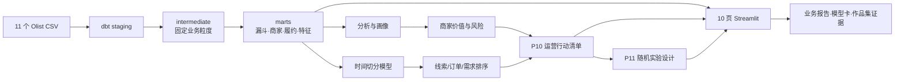
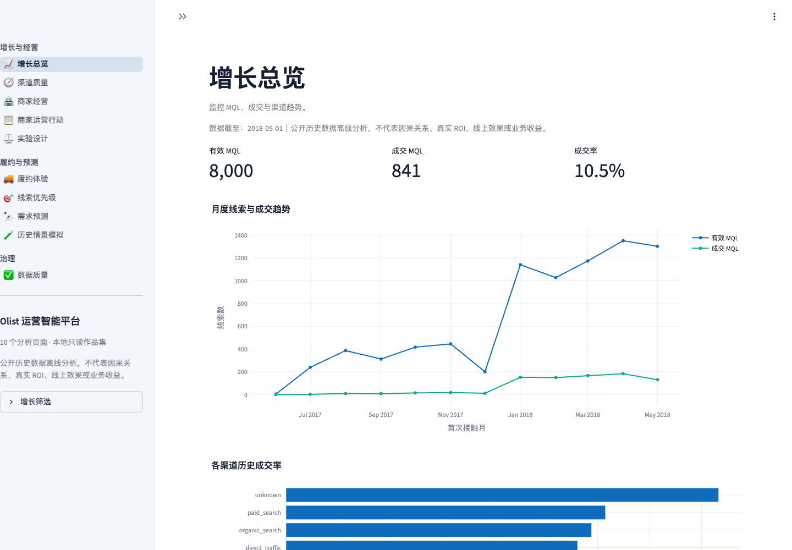
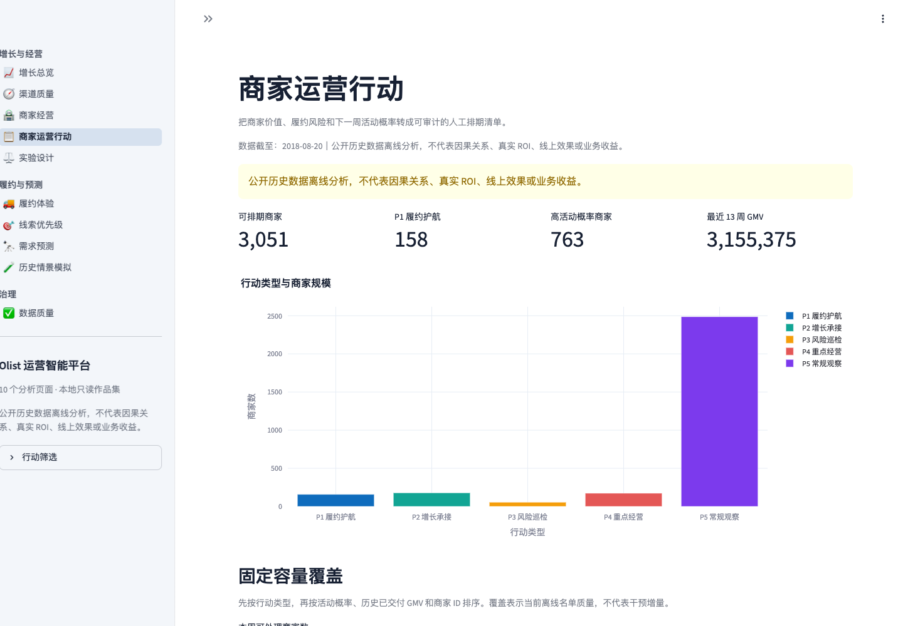
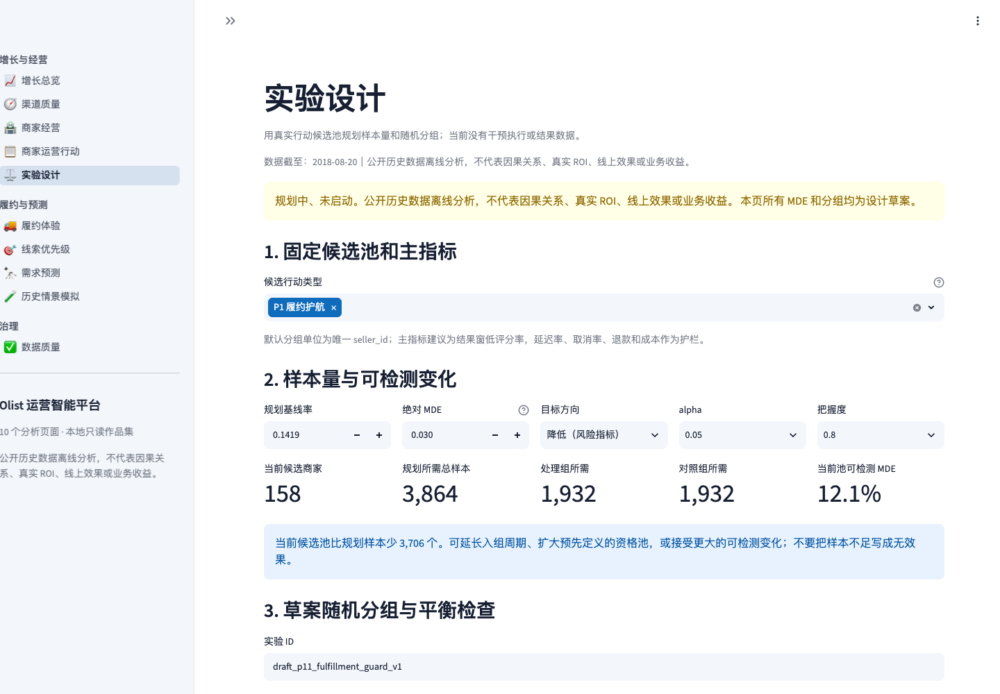
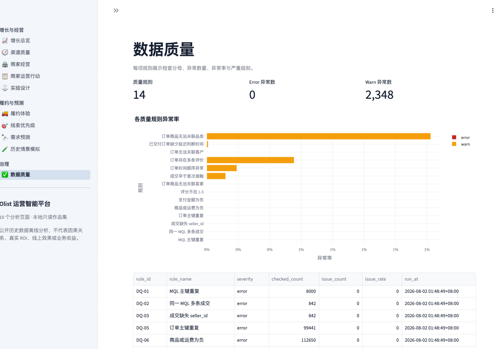

# P12 作品集展示与面试演示指南

## 1. P12 的目标

P12 不增加新模型，而是把已完成的 P0–P11 整理成一个招聘方能快速判断价值、面试时能顺畅演示、每个数字都能回到证据文件的投递版本。

目标读者是数据分析、增长分析、商业分析、BI 分析和电商运营分析岗位的招聘经理或面试官。默认阅读时间分为三档：

- 30 秒：只看 README 开头和作品集案例摘要，理解业务链路与项目规模；
- 3–5 分钟：看案例报告与关键图表，判断分析、建模、决策和实验意识；
- 15–20 分钟：按演示路线进入 Streamlit，并通过证据索引追问指标、模型、泄漏和局限。

成功标准：展示材料不依赖口头补充才能理解；关键数字与当前 artifacts/DuckDB 对账；演示路线不在十个页面之间来回跳；不把离线模型、容量覆盖或实验规划说成真实业务收益。

## 2. 一句话和 30 秒介绍

### 一句话

基于 Olist 公开匿名数据，把“线索获取 → 商家成交 → 商家经营 → 订单履约 → 用户体验”串成一套可追溯的数据仓库、预测模型、运营行动清单和实验设计平台。

### 30 秒版本

项目覆盖 8,000 条营销线索、约 9.94 万笔订单和 3,095 个商家。我先用 DuckDB 与 dbt 解决跨表粒度和指标口径，再做线索成交、低评分风险和商家/品类需求预测。模型全部按时间切分并与基线比较，最终没有停在模型分数，而是把价值、风险和活动概率转成 3,051 行商家行动清单，并为真实干预准备了随机实验和日志契约。项目明确不虚构 ROI 或线上效果。

## 3. 项目架构图



架构的重点不是工具数量，而是每层职责清楚：dbt 固化口径，模型只消费预测时点可用特征，行动层不发明无经济依据的综合分，实验层不把规划当结果。

## 4. 五分钟演示路线

### 0:00–0:40｜增长总览：先讲完整业务链

打开“增长总览”。先说明数据覆盖 8,000 条 MQL、841 条合法成交，整体成交率 10.51%；样本已交付 GMV 为 1,541.98 万，延迟率 8.11%，低评分率 14.19%。

要讲的判断：项目不是单点预测，而是把渠道、成交商家后续经营和用户体验放在同一条链路中。不要把 GMV说成收入或利润。

### 0:40–1:30｜渠道质量：说明为什么不能只看成交率

打开“渠道质量”。对比 `organic_search` 与 `unknown`：前者成交率 11.76%、延迟率 4.87%、低评分率 9.52%；后者成交率 16.65%，但延迟率 9.09%、低评分率 14.35%，而且来源不可归因。

要讲的判断：表面转化更高不等于更值得追加资源；`unknown` 应先修复追踪，再谈投放。没有渠道成本，所以不计算 ROI。

### 1:30–2:20｜履约体验：把描述性热点变成可行动风险池

打开“履约体验”或“商家经营”。说明 199 个高价值高风险商家覆盖 405.95 万已交付 GMV，占样本已交付 GMV约 26.33%；风险率只有在至少 20 单的可靠分母下才参与分层。

要讲的判断：优先保护高价值风险暴露，而不是按单个高差评率排序。地区和品类只是调查线索，不证明因果。

### 2:20–3:30｜商家运营行动：展示从模型到运营取舍

打开“商家运营行动”，容量保持 200。说明统一规则覆盖 79.40% 的可评分高价值高风险商家，而只按活动概率和只按近期 GMV 排序分别为 22.61% 和 26.63%。同时主动指出统一规则牺牲了活动概率质量和近期 GMV覆盖。

要讲的判断：没有成本、利润和干预收益时，不构造伪精确加权总分；用互斥业务规则和单目标对照把取舍摆出来。

### 3:30–4:20｜模型证据：强调边界和负面结果

根据岗位选择“线索优先级”或“需求预测”。线索模型 PR-AUC 0.193，高于 0.119 基线；低评分逻辑回归 PR-AUC 0.197，Top 10% Lift 2.32。商家活动 PR-AUC 0.680，但订单量 WAPE 仍为 84.46%；Croston-SBA WAPE 174.69% 的失败结果被保留。

要讲的判断：排序有用不等于概率天然可靠，聚合改善不等于精确预测。项目用滚动时间窗、bootstrap、独立校准和泄漏测试约束结论。

### 4:20–5:00｜实验设计与数据质量：用诚实边界收尾

打开“实验设计”。默认 P1 只有 158 个商家；若希望识别低评分率降低 3 个百分点，规划需要 3,864 个成熟样本。再切到“数据质量”展示 57 项 dbt 数据测试和两个保留告警。

要讲的判断：行动清单不能证明干预有效，下一步需要真实执行和结果日志。单周样本不足不能被写成“没有效果”。

## 5. 不同岗位的讲解重点

| 目标岗位 | 重点展示 | 建议弱化 |
|---|---|---|
| 数据分析 | 指标口径、粒度治理、质量测试、渠道/履约结论 | 模型算法细节 |
| 增长分析 | 漏斗、渠道质量、Top-K容量、实验设计 | dbt 宏实现细节 |
| 商业分析 | 价值×风险分层、资源取舍、决策建议、局限 | 大段特征工程 |
| BI 分析 | 分层数据模型、指标字典、看板一致性、可追溯 | 候选模型调参 |
| 电商运营分析 | 商家画像、履约热点、行动清单、容量排期 | 统计公式推导 |

## 6. 四张关键截图的建议

P12 的截图只用于简历附件或作品集预览，不能替代可交互 Streamlit。建议固定窗口尺寸并使用以下页面：

1. `01_growth_overview.png`：增长总览默认状态，证明业务链完整；
2. `02_seller_ops_actions.png`：容量 200 的行动页，突出风险覆盖与单目标取舍；
3. `03_experiment_design.png`：实验设计默认状态，突出 158 对 3,864 的可行性判断；
4. `04_data_quality.png`：数据质量页，证明异常没有被静默删除。

截图必须来自真实本地数据和当前代码，不手工改数字。P13 已在统一主题、折叠筛选和图表标题完成后重新生成，并让脚本等待页面骨架消失、强制回到顶部，避免截到半加载或残留滚动位置。

### 当前实图（2026-08-02）









## 7. 可说与不可说

| 主题 | 可以说 | 不可以说 |
|---|---|---|
| 渠道 | `unknown` 在公开样本中转化高但体验更弱，应先修复归因 | `unknown` 渠道一定导致低评分 |
| 模型 | 时间外测试排序优于先验基线 | 模型准确预测每个商家或订单 |
| 行动 | 容量 200 时清单覆盖 79.40% 可评分高价值高风险商家 | 护航使低评分下降 79.40% |
| 需求 | 商家活动分类具有较好排序能力 | 商家订单量预测准确，可直接补货 |
| 实验 | 当前池不足以识别 3 个百分点变化 | 预计护航会降低 3 个百分点 |
| 商业价值 | 建立可复现的离线决策系统和真实实验入口 | 已产生真实利润、ROI 或线上增长 |

## 8. 证据索引

| 面试结论 | 权威证据 |
|---|---|
| 数据规模、漏斗、GMV、体验率 | `artifacts/analysis_snapshot.json` |
| dbt 模型和测试结果 | `dbt/target/run_results.json`、P12/P2 日志 |
| 线索和低评分指标 | `artifacts/lead_conversion/metrics.json`、`artifacts/review_risk/metrics.json` |
| 需求与活动指标 | `artifacts/demand_forecast/metrics.json` |
| 行动数量与容量对照 | `artifacts/demand_forecast/seller_ops_metadata.json` |
| 实验样本量和边界 | `reports/experiment_design_report.md`、`src/experiments.py` |
| 许可、隐私、用途边界 | `reports/data_card.md`、`THIRD_PARTY_NOTICES.md` |
| 5 条简历 bullet | `reports/resume_bullets.md` |
| 四类岗位定制 bullet | `reports/resume_bullets_by_role.md`、`reports/jd_tailoring_checklist.md` |
| 发布和真实落地边界 | `RELEASE_CHECKLIST.md`、`docs/10_real_world_rollout_playbook.md` |

生成产物默认不提交版本库时，面试数字应通过 README 的完整流程重新生成；不得只凭本指南手工填写。

## 9. 一键验收

快速投递检查使用：

```bash
make portfolio-check
```

该命令会重新生成统一证据，并检查其是否与当前分析、模型和行动产物一致；还会检查五类行动数量加总、容量对照、内部链接、四张 PNG 的格式和尺寸、简历 bullet 是否为 5 条、面试问题是否为 20 个，并运行作品集与 10 页看板专项测试。它不是完整模型重训；需要从原始数据全量复现时仍使用 `make verify`。

## 10. 演示前检查清单

- 数据库、模型产物和分析快照存在；
- `make portfolio-check` 通过；
- `make repo-check` 通过，确认原始数据、数据库、模型二进制和敏感配置未进入候选文件；
- Streamlit 可以启动，浏览器缩放恢复 100%；
- 默认先打开增长总览，不从模型页面开始；
- 行动页容量为 200，实验页保持默认 P1；
- 准备一句负面结果：Croston 失败或间歇层 WAPE 高；
- 准备一句边界：没有成本和真实干预结果，因此不说 ROI；
- 结束时回到“下一步真实实验”，不要以模型分数作为结尾。
